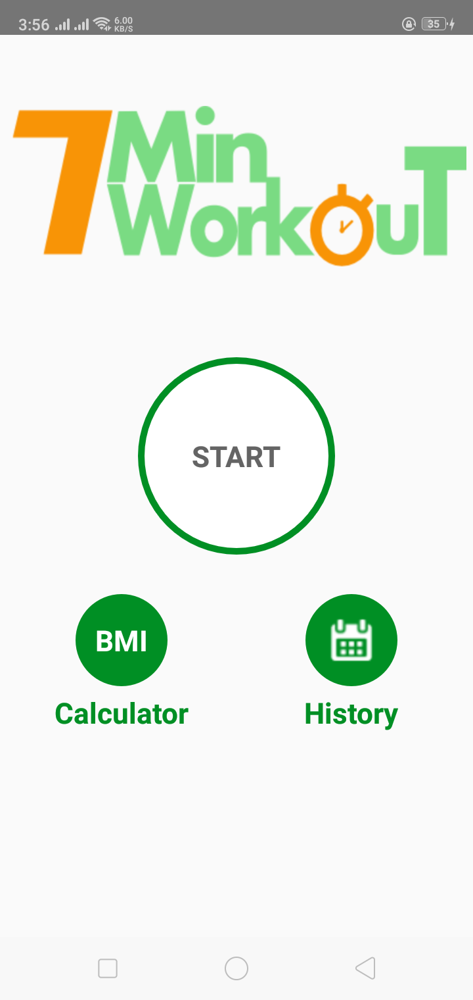
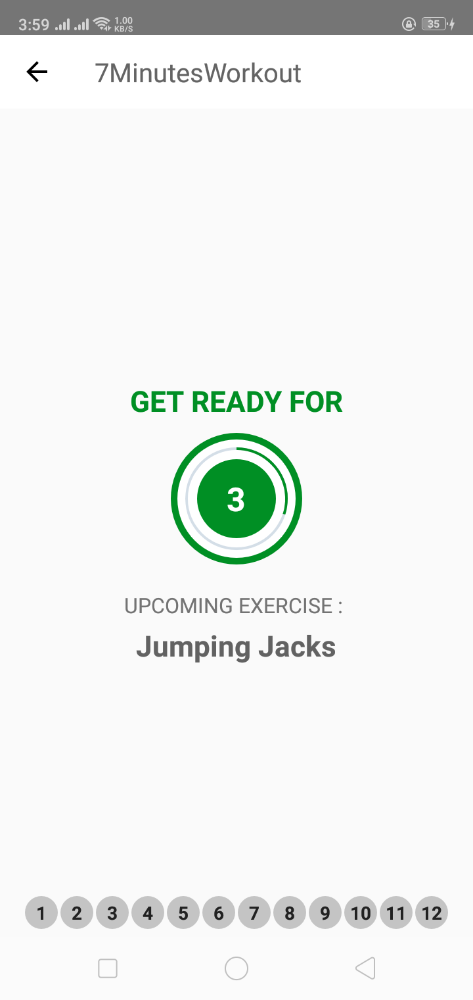
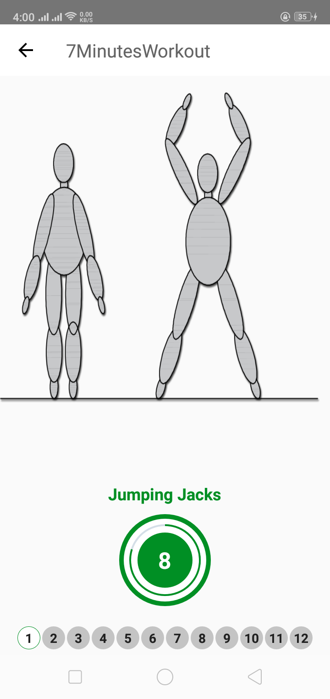
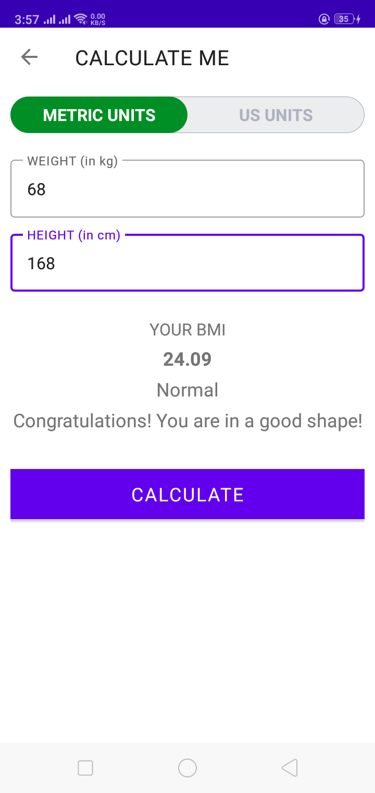
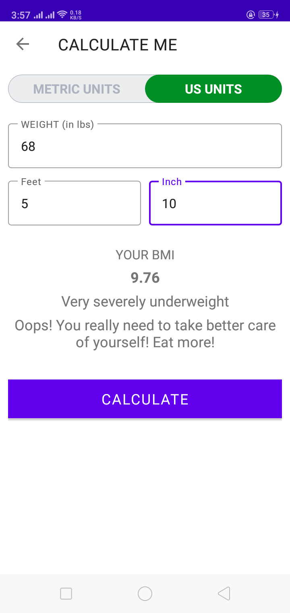
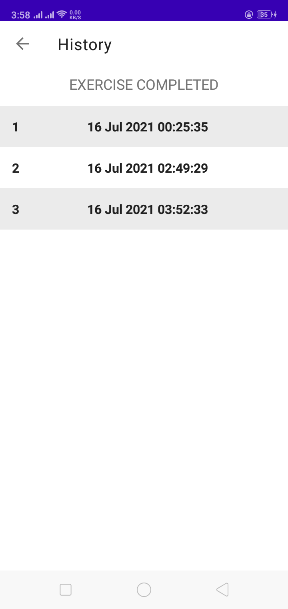

# 7 Minutes Workout app
This is the 5th project based on "The Complete Android 10 & Kotlin Development Masterclass"

## Main Screen

## View: Get Ready For

## View: Active Exercise

## Unit System: Metric

## Unit System: US

## History: List of dates when exercises were completed
